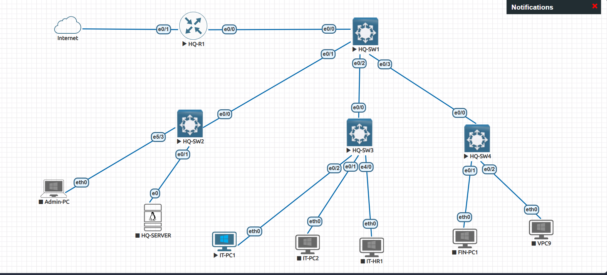

# Project Atlas

## Overview

Project Atlas is a realistic enterprise network built in EVE-NG to demonstrate practical networking, Linux server administration, network security, and automation skills.

The project simulates the design, deployment, and operation of a modern enterprise network using Cisco IOL devices, Ubuntu Server, and enterprise networking best practices.

The goal of this project is to build a production-inspired network that goes beyond CCNA-level configuration while remaining practical, well documented, and interview-ready.

---

# Current Topology



> **Note:** The topology evolves as new enterprise technologies are implemented. The image above always reflects the latest version of the network.

---

# Technologies

### Networking

- Cisco IOL Layer 2
- Cisco IOL Layer 3
- EVE-NG

### Servers

- Ubuntu Server

### Security

- Cisco ASA Firewall

### Automation

- Python
- Ansible

---

# Enterprise Features

## Core Networking

- VLANs
- Trunking
- Inter-VLAN Routing
- Static Routing
- OSPF
- EtherChannel
- HSRP

## Infrastructure Services

- DHCP
- DNS
- Apache Web Server
- Samba File Server

## Security

- SSH Management
- Management VLAN
- ACLs
- NAT/PAT
- DHCP Snooping
- Dynamic ARP Inspection
- Port Security
- Cisco ASA Firewall

## VPN

- GRE over IPsec

## Automation

- Python Automation
- Ansible Playbooks

---

# Current Status

**Current Release:** **v0.4.0**

## Completed

- ✅ Enterprise topology created
- ✅ VLAN implementation
- ✅ Trunk configuration
- ✅ Inter-VLAN routing
- ✅ Management VLAN
- ✅ Secure SSH management
- ✅ Static routing
- ✅ WAN connectivity
- ✅ Internet access
- ✅ Ubuntu Server deployment
- ✅ Enterprise DHCP Server
- ✅ Enterprise DNS Server
- ✅ Apache Web Server
- ✅ Samba File Server
- ✅ Layer 3 EtherChannel (LACP)
- ✅ HSRP Gateway Redundancy
- ✅ Dual-homed Access Layer


## In Progress

- 🔄 Enterprise Security
  - DHCP Snooping
  - Dynamic ARP Inspection (DAI)
  - Port Security
  - BPDU Guard
  - Storm Control
---

# Project Structure

```
project-atlas/
│
├── automation/
├── configs/
├── docs/
├── screenshots/
├── servers/
├── CHANGELOG.md
└── README.md
```

---

# Documentation

Additional documentation can be found in the **docs/** directory.

- VLAN Plan
- IP Addressing Plan

---

# Project Goals

- Build a realistic enterprise campus network.
- Apply industry-standard network design principles.
- Document every major implementation milestone.

---

# Project Status

🚧 Active Development