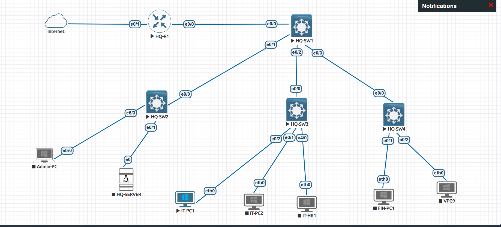

# Project Atlas

## Overview

Project Atlas is a production-inspired enterprise network built in EVE-NG to demonstrate practical network engineering, Linux infrastructure, network security, and network automation skills.

The project simulates a resilient multi-site enterprise environment using Cisco IOL devices, a Cisco ASA firewall, and Ubuntu Server infrastructure services. The network has been developed incrementally, with configurations, implementation documentation, validation screenshots, and project milestones maintained throughout development.

---

## Skills Demonstrated

**Networking:** VLANs & Trunking · Inter-VLAN Routing · OSPF · EtherChannel (LACP) · HSRP · Static Routing · WAN Connectivity

**Security:** ACLs · NAT/PAT · Port Security · DHCP Snooping · Dynamic ARP Inspection · Site-to-Site IPsec VPN · Cisco ASA Firewall - TACACS+ authentication

**Systems Administration:** Linux (Ubuntu Server) · DHCP · DNS · Apache · Samba -Syslog

**Automation:** Ansible 

**Tools & Platforms:** EVE-NG · Cisco IOL · Git/GitHub

---

## Current Topology



> **Note:** The topology evolves as new enterprise technologies are implemented. The image above always reflects the latest version of the network.

---

## Technologies

- EVE-NG
- Cisco IOL Layer 2 & Layer 3
- Cisco ASA Firewall
- Ubuntu Server
- Ansible

## Network Infrastructure

The enterprise topology includes:

- VLANs and 802.1Q trunking
- Inter-VLAN routing
- Static routing
- OSPF
- Layer 3 EtherChannel using LACP
- HSRP gateway redundancy
- Dual-homed access layer
- WAN connectivity
- Internet connectivity
- NAT/PAT

## Infrastructure Services

Ubuntu Server node provides infrastructure services to Windows and Linux clients and Cisco network devices.

Implemented services include:

- ISC DHCP Server
- BIND9 DNS
- Apache Web Server
- Samba File Server
- Centralized Syslog
- TACACS+ AAA

The server environment also provides a practical platform for developing Linux administration skills, including users, permissions, services, networking, configuration management, and troubleshooting.

## Network Security

Security controls implemented across the environment include:

- Cisco ASA Firewall
- Access Control Lists (ACLs)
- Management VLAN
- SSH device management
- Port Security
- DHCP Snooping
- Dynamic ARP Inspection (DAI)
- PortFast
- BPDU Guard
- NAT/PAT
- Route-based Site-to-Site IPsec VPN using IKEv2
- OSPF route exchange across the VPN
- Centralized TACACS+ authentication and authorization for Cisco device administration

## Network Automation

Ansible is used to automate repetitive network administration tasks across the Cisco infrastructure.

Completed automation includes:

- Automated NTP configuration
- Centralized Syslog configuration
- Automated Cisco AAA / TACACS+ configuration
- Automated Cisco running-configuration backups
- Date-based configuration backup storage
- Network device command execution and configuration management

The automation work is developed incrementally alongside the network infrastructure rather than treating automation as a separate exercise.

---

## Monitoring & Data Analysis

Monitoring and network data analysis will be developed separately from the core Project Atlas infrastructure.

A companion repository will focus on collecting, processing, analysing, and visualising selected network data generated by Project Atlas using technologies such as:

- Python
- Pandas
- matplotlib


This separation keeps Project Atlas focused on **network infrastructure, services, security, and automation**, while the companion repository focuses on **network monitoring, data analysis, and visualisation**.

> Companion analytics repository: *Coming soon*

---

## Project Structure

```text
project-atlas/
│
├── automation/       # Ansible playbooks and automation files
├── configs_HQ/       # Headquarters device configurations
├── configs_BR/       # Branch device configurations
├── docs/             # Technical implementation documentation
├── screenshots/      # Topology and validation screenshots
├── CHANGELOG.md      # Project milestones and changes
└── README.md         # Project overview